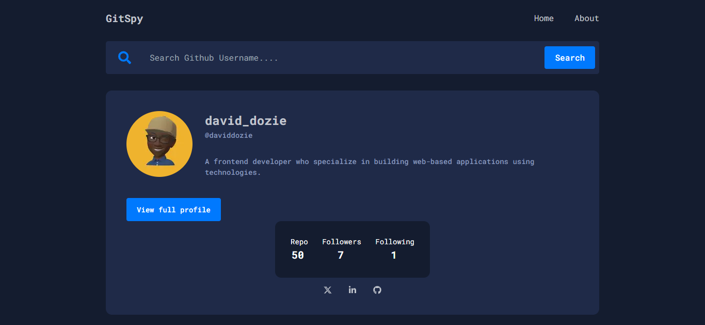

# GitSpy



GitSpy is a powerful and user-friendly GitHub profile finder that allows users to search for any GitHub profile and explore its details instantly.

## 🚀 Features
- 🔎 Search for any GitHub username
- 📊 View user details: avatar, bio, repositories, followers, and following
- 🌐 Quick access to social media links (GitHub, Twitter, LinkedIn)
- 🎨 Responsive and visually appealing UI
- ⚡ Fast and efficient API fetching

## 🛠️ Tech Stack
- **Frontend:** Next.js, React, Tailwind CSS
- **API:** GitHub REST API
- **Styling:** Tailwind CSS
- **Icons:** React Icons
- **Hosting:** Vercel

## 🏗️ Installation
Follow these steps to set up GitSpy locally:

```bash
# Clone the repository
git clone https://github.com/daviddozie/GitSpy.git

# Navigate to the project directory
cd gitspy

# Install dependencies
npm install  # or yarn install

# Start the development server
npm run dev  # or yarn dev
```

Then, open `http://localhost:3000` in your browser.

## 🚀 Deployment
GitSpy is deployed on Vercel. To deploy your own version:
1. Fork the repository.
2. Connect it to Vercel.
3. Deploy with a single click!

## 🤝 Contributing
We welcome contributions! To contribute:
1. Fork the project.
2. Create a new branch (`git checkout -b feature-branch`).
3. Commit your changes (`git commit -m 'Add new feature'`).
4. Push to the branch (`git push origin feature-branch`).
5. Open a pull request.

## 📜 License
This project is licensed under the MIT License.

## 📞 Contact
For inquiries, reach out:
- **GitHub:** [@DavidMgbede](https://github.com/daviddozie)
- **Portfolio:** [david-mgbede.vercel.app](https://david-mgbede.vercel.app)

---

Made with ❤️ by David Mgbede 🚀
